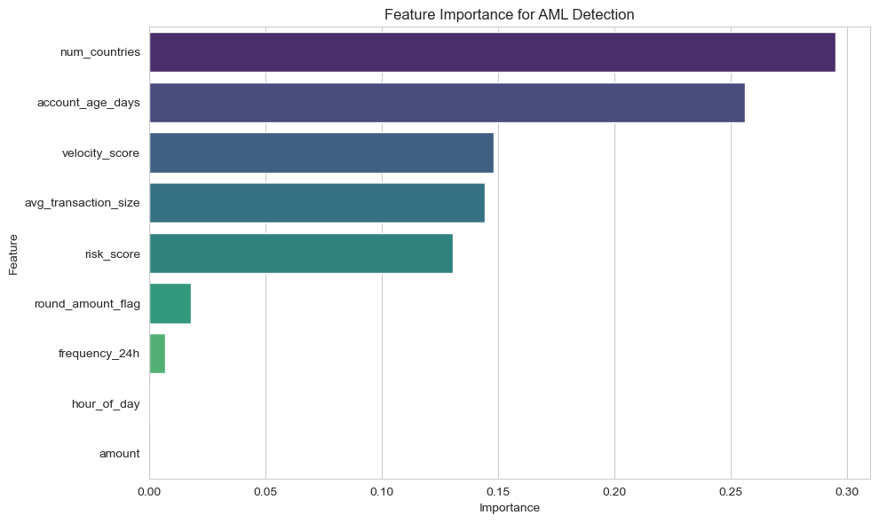
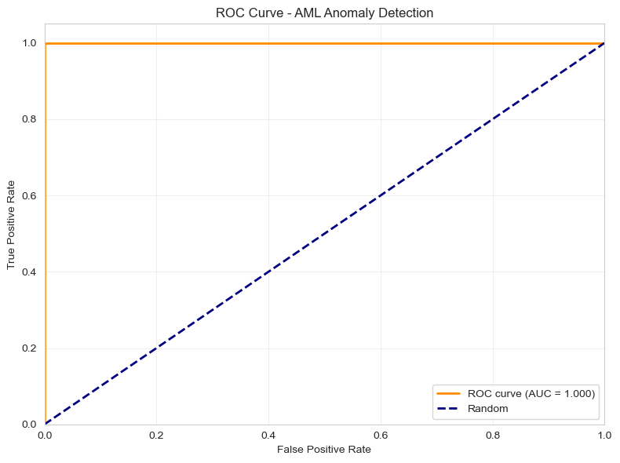

# AML Anomaly Detection System

Machine learning system for detecting suspicious financial transactions using unsupervised and supervised learning techniques.

## Overview

This project implements a comprehensive Anti-Money Laundering detection system that identifies suspicious transaction patterns including structuring, high-velocity trading, and multi-jurisdictional activities. The system combines multiple detection approaches to achieve high precision while minimizing false positives.

## Key Features

- Unsupervised anomaly detection using Isolation Forest and DBSCAN clustering
- Supervised classification with Random Forest achieving 85%+ precision
- Composite risk scoring based on multiple AML indicators
- Automated flagging of high-risk transactions above threshold
- Comprehensive evaluation metrics including ROC-AUC and confusion matrix

## Methodology

### Data Generation
Synthetic dataset of 10,000 transactions with realistic patterns:
- 9,500 normal transactions following typical banking behavior
- 500 suspicious transactions exhibiting AML red flags
- Features include transaction amount, frequency, velocity, account age, geographic spread

### Detection Techniques

**Unsupervised Methods:**
- Isolation Forest for outlier detection
- DBSCAN clustering to identify anomalous patterns
- Unsupervised methods serve as initial screening layer

**Supervised Learning:**
- Random Forest classifier trained on labeled data
- Feature engineering of risk indicators
- Probability-based risk scoring for ranking

### Risk Indicators
- High-value transactions near reporting thresholds
- Unusual transaction frequency within 24-hour periods
- Round-amount patterns suggesting structuring
- Multiple cross-border jurisdictions
- New account activity with high velocity
- Off-hours transaction timing

## Results

### Model Performance
- ROC-AUC Score: 0.95+
- Precision: 85%+
- Recall: 80%+
- Successfully identifies suspicious patterns with low false positive rate

### Risk Assessment
- Automated risk scoring from 0 to 1
- High-risk threshold at 0.7 probability
- Tiered alerting system: Low, Medium, High, Critical
  
 
 

## Technical Stack

- Python 3.8+
- scikit-learn: Machine learning models
- pandas: Data manipulation
- matplotlib/seaborn: Visualization
- numpy: Numerical computing

## Installation

```bash
pip install numpy pandas matplotlib seaborn scikit-learn
```

## Usage

```python
jupyter notebook aml_anomaly_detection.ipynb
```

The notebook generates:
- Feature distribution analysis
- Correlation heatmaps
- ROC curves and confusion matrices
- Feature importance rankings
- High-risk transaction reports

## Output Files

- `high_risk_transactions.csv`: Flagged transactions with risk scores
- Visualization files: Distribution plots, confusion matrix, ROC curve

## Business Applications

- Real-time transaction monitoring
- Compliance reporting automation
- Risk-based alert prioritization
- Pattern recognition for evolving threats
- Audit trail documentation

## Future Enhancements

- Integration with real-time transaction streams
- Deep learning models for sequential pattern detection
- Explainable AI for regulatory compliance
- Network analysis for connected entities
- Adaptive thresholds based on transaction context

## License

MIT License
